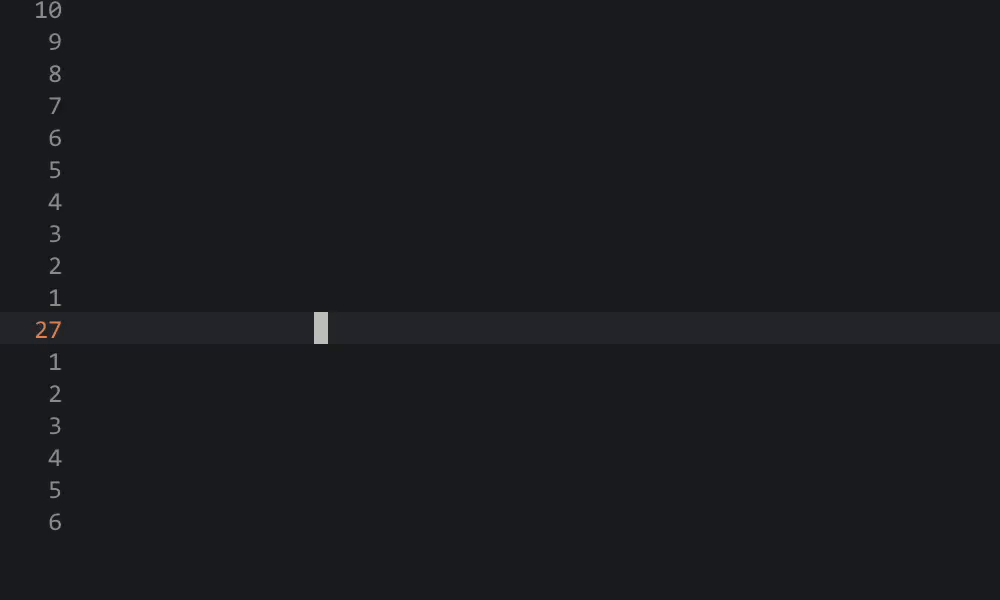

# spinner.nvim

[](https://github.com/xieyonn/spinner.nvim/actions/workflows/test.yaml)

Lightweight spinner component for Neovim.

## Quick Start

Using [lazy.nvim](https://github.com/folke/lazy.nvim)

```lua
return {
  {
    "xieyonn/spinner.nvim",
    config = function()
      require("spinner").setup({
        -- options here
      })
    end,
  },
}
```

Display the spinner next to the cursor:

```lua
:= require("spinner").cursor_spinner({ ttl = 2000 }):start()
```



## Usage

1. Create a spinner object

```lua
local sp = require("spinner").new()
```

> you can treat `sp` as a read-only string that updates automatically.

2. Place `sp` to wherever you want.
   eg: statusline

```lua
-- use a global function here.
function sp_component()
  return tostring(sp)
end

vim.o.statusline = vim.o.statusline .. "%!v:lua.sp_component()"
```

3. In order to make the spinner actually animate, you need to provide an
   `on_change` callback (called when spinner move to next frame) so it can
   refresh the UI.

```lua
local sp = require("spinner").new({
    on_change = function()
        -- refresh statusline
        vim.cmd("redrawstatus")
    end
})

-- This is essentially just a function that has already been encapsulated as `statusline_spinner`.
local sp = require("spinner").statusline_spinner()

--- create a tabline_spinner, which call vim.cmd("redrawtabline") in on_change.
local sp = require("spinner").tabline_spinner()

--- create a cursor spinner, which create a floating window to display spinner.
local sp = require("spinner").cursor_spinner()
```

4. start/stop spinner according to your needs.

```lua
sp:start()
sp:stop()
```

A example of subscribe `LspProgress` event:

```lua
vim.api.nvim_create_autocmd("LspProgress", {
  callback = function(event)
    local kind = event.data.params.value.kind
    if kind == "begin" then
        sp:start()
    end
    if kind == "end" then
        sp:stop()
    end
  end,
})
```

> LspProgress may emit multiple start/stop events in a short time, spinner can
> handle this by counting start/stop pairs.

## API

### spinner

```lua
---@class spinner
---@field new fun(opts?: spinner.Opts) create a spinner object
---@field statusline_spinner fun(opts?: spinner.Opts) create a statusline_spinner
---@field tabline_spinner fun(opts?: spinner.Opts) create a tabline_spinner
---@field cursor_spinner fun(opts?: spinner.CursorOpts) create a cursor_spinner
```

### spinner.Spinner

```lua
---@class spinner.Spinner
---@field start fun(self: spinner.Spinner) start spinner
---@field stop fun(self: spinner.Spinner) stop spinner
---@field __tostring fun(self: spinner.Spinner)
```

### spinner.Opts

```lua
---@class spinner.Event
---@field text string current spinner text.
---@field enabled boolean true -> start means, false means stop.

---@class spinner.Opts
---@field texts? string[]
---@field interval? integer -- refresh interval millisecond.
---@field ttl? integer -- the spinner will automatically stop after that {ttl} millisecond.
---@field initial_delay? integer -- delay display spinner after {initial_delay} millisecond.
---@field on_change? fun(event: spinner.Event) -- spinner will call {on_change}
---when spinner animate. use this callback to update UI, eg: redrawstatus
```

### spinner.CursorOpts

```lua
---@class spinner.CursorOpts: spinner.Opts
---@field hl_group? string -- highlight group for spinner text, link to NormalFloat by default.
---@field winblend? integer -- CursorSpinner floating window option.
---@field width? integer -- CursorSpinner floating window option.
---@field row? integer -- CursorSpinner floating window option.
---@field col? integer -- CursorSpinner floating window position, relative to cursor.
---@field zindex? integer -- CursorSpinner floating window position, relative to cursor.
```

### Default Opts

```lua
local default_opts = {
  texts = { "⠋", "⠙", "⠹", "⠸", "⠼", "⠴", "⠦", "⠧", "⠇", "⠏" },
  interval = 80,
  ttl = 0,
  initial_delay = 200,
  on_change = nil,
  hl_group = "Spinner",
  winblend = 60,
  width = 1,
  zindex = 50,
  row = -1,
  col = 1,
}
```
